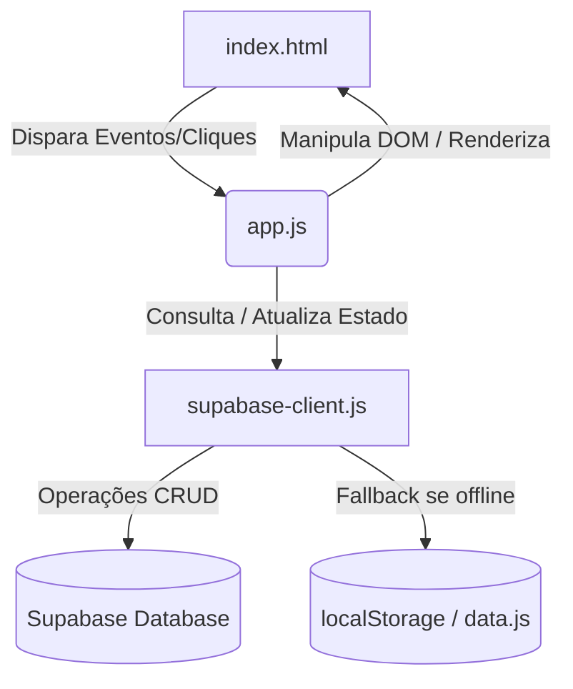

# 🎮 RE:Motion Performance Shop - Detonado do Sistema e Arquitetura

Este documento é um **guia completo/detonado** do sistema do site da **RE:Motion Performance Shop**. Ele detalha toda a arquitetura de arquivos, o fluxo de dados, o sistema de permissões, o banco de dados Supabase e as funções que fazem o sistema funcionar.

---

## 🗺️ 1. Estrutura de Arquivos (Visão Geral)

O projeto é construído como uma aplicação web de página única (Single-Page Application - SPA) focada no lado do cliente (Client-Side), organizada da seguinte forma:

| Arquivo | Função Principal | Descrição Detalhada |
| :--- | :--- | :--- |
| **`index.html`** | Estrutura UI | Contém todo o HTML do site, barra lateral de navegação, telas principais de categorias, modais de edição, carrinho de compras e links de importação de estilos/scripts. |
| **`style.css`** | Design e Temas | Controla toda a identidade visual. Possui suporte para o tema escuro padrão (`theme-dark`) e a transição dinâmica para o tema dourado (`theme-gold`) ao entrar na Área Ilegal. Totalmente responsivo. |
| **`app.js`** | Cérebro / Lógica | O maior arquivo do sistema. Controla o estado da aplicação (carrinho, filtros, dados ativos), o fluxo de telas, o cálculo de materiais, a renderização de tabelas/cards e os cliques nos botões. |
| **`supabase-client.js`** | Banco de Dados | Camada de abstração que faz a comunicação direta com o banco de dados do Supabase. Possui um sistema de fallback para `localStorage` caso a conexão falhe ou o banco esteja offline. |
| **`data.js`** | Dados de Backup | Dados estáticos padrões (receitas, materiais, membros iniciais) usados como fallback caso o banco de dados Supabase não retorne informações. |
| **`commit.bat`** | Utilitário Git | Script para automatizar o processo de commit e push no repositório. |

---

## 🏗️ 2. Arquitetura e Fluxo de Dados

A arquitetura segue um fluxo reativo simples baseado em eventos:



1. **Inicialização**:
   - `index.html` carrega as dependências.
   - `app.js` chama `loadData()`.
   - `loadData()` consulta `supabase-client.js` para preencher as variáveis em memória (`activeComponents`, `activeMembers`, etc.).
   - Se a chamada ao Supabase falhar, o sistema ativa o modo offline automaticamente usando dados locais.
2. **Atualização da Interface**:
   - A interface do usuário (UI) é atualizada limpando contêineres HTML e recriando os elementos dinamicamente a partir dos arrays ativos.
   - Exemplo: `renderItems()` lê do array `activeProducts` e renderiza os cards na tela de produtos.

---

## 🔒 3. Sistema de Autenticação e Área Ilegal

O site possui duas áreas distintas com fluxos de acessos diferentes:

### 🛡️ Área Legal / Administrativa
* **Login de Administrador**: Feito via e-mail e senha no Supabase (`db.login(email, password)`). Dá acesso a funções de administração avançadas.
* **Login de Membro**: Feito via número de Passaporte e Senha própria (`db.memberLogin(passport, password)`). Identifica qual membro está utilizando o sistema para registrar logs e definir permissões de visualização.

### 🖤 Área Ilegal (Tema Dourado)
* **Acesso Direto**: A Área Ilegal não exige senha ou passaporte para visualização básica. Ela é ativada/desativada clicando diretamente no botão de alternância ilegal na barra lateral.
* **Transição de Tema**: Ao ativar a área ilegal, a classe CSS `theme-gold` é injetada no elemento principal, alterando as cores do site de vermelho/cinza para tons de dourado e preto.
* **Ações Avançadas**: Embora a visualização seja livre, certas ações na área ilegal (como editar receitas ou cadastrar veículos apreendidos) ainda são restritas por permissões.

---

## 🔑 4. Sistema de Cargos e Permissões

As permissões no sistema são dinâmicas e baseadas em papéis atribuídos aos membros.

### Lista de Permissões Existentes
* `edit_stages`: Permissão para criar/editar peças de Stage (Componentes).
* `edit_services`: Permissão para criar/editar serviços de manutenção.
* `edit_products`: Permissão para criar/editar produtos da loja.
* `edit_members`: Permissão para cadastrar, editar ou demitir membros.
* `access_vault`: Permissão para acessar e fazer transações no Cofre de Materiais.
* `access_illegal`: Permissão para acessar recursos avançados da Área Ilegal.
* `manage_roles`: Permissão para criar e alterar níveis de cargos e suas respectivas permissões.

### Regra de Super-Membros (Bypass)
Determinados cargos de alta gerência ignoram a validação individual de permissões e têm acesso irrestrito a todas as ferramentas.
* **Cargos com bypass legal**: `CEO`, `Vice Presidente`, `Gerente`.
* **Cargos com bypass ilegal**: `01`, `Gerente ilegal`.

---

## 📦 5. Modelagem do Banco de Dados (Tabelas)

O arquivo `supabase-client.js` gerencia a leitura e escrita nas seguintes tabelas do Supabase:

| Tabela | Campos Principais | Descrição |
| :--- | :--- | :--- |
| **`materials`** | `id`, `name`, `amount`, `updated_at` | Estoque de materiais do cofre (ex: Sucata, Aço, Fio de Cobre). |
| **`items`** | `id`, `name`, `category`, `sub_category`, `price`, `materials_needed` (JSON) | Catálogo de componentes, serviços e produtos com suas respectivas receitas de materiais. |
| **`members`** | `id`, `passport`, `name`, `role`, `illegal_role`, `avatar_url`, `status`, `joined_at` | Registro de funcionários da oficina com seu cargo legal e ilegal. |
| **`mural`** | `id`, `title`, `content`, `author`, `created_at`, `is_illegal` | Recados e avisos postados na tela inicial (Legal ou Ilegal). |
| **`vault_logs`** | `id`, `member_name`, `action` (deposit/withdraw), `material_name`, `amount`, `created_at` | Histórico detalhado de movimentações do cofre de materiais. |
| **`impounded_cars`** | `id`, `owner_name`, `plate`, `car_model`, `status`, `impound_date` | Registro de carros apreendidos/guardados na área ilegal. |
| **`illegal_recipes`** | `id`, `name`, `materials` (JSON), `sell_price`, `production_time` | Receitas e itens de fabricação exclusiva da facção/área ilegal. |

---

## 🛠️ 6. Principais Funções do Sistema (`app.js`)

Aqui está o índice das principais funções organizadas por funcionalidade:

### ⚙️ Inicialização e Estado
* **`loadData()`**: Busca assincronamente todas as tabelas do Supabase e atualiza o estado local do app.
* **`switchCategory(category)`**: Gerencia a navegação entre as abas (`home`, `components`, `vault`, `illegal-recipes`, etc.) atualizando a classe `.active` no menu lateral.
* **`updateAuthUI()`**: Reestrutura dinamicamente a barra de navegação, botões de ação e modais com base nas permissões do usuário logado.

### 🛒 Carrinho e Orçamentos
* **`addToCart(itemId, category)`**: Insere um item no carrinho de compras.
* **`updateCart()`**: Atualiza a visualização do painel lateral do carrinho e recalcula valores.
* **`calculateTotals()`**: Calcula a lista acumulada de materiais necessários para todos os itens presentes no carrinho, além de calcular o valor total de venda.

### 👥 Gestão de Pessoas e Cargos
* **`renderMembersScreen()`**: Gera a lista visual de membros com seus avatares (redondos) e botões de edição de cargo.
* **`renderHierarchyScreen()` / `renderIllegalHierarchy()`**: Exibe organogramas hierárquicos interativos baseados nos cargos definidos para o lado Legal e Ilegal.
* **`hasPermission(permissionName)`**: Retorna `true` ou `false` se o usuário logado possui a permissão informada ou cargo de gerência.

### 💎 Cofre de Materiais
* **`renderVaultScreen()`**: Exibe o saldo do cofre de materiais em tempo real.
* **`handleVaultTransaction(type)`**: Processa depósitos e retiradas de materiais, atualizando a tabela `materials` e gerando um registro em `vault_logs`.

### 🛡️ Modais de Edição e CRUD
* **`openItemEditModal(item)`**: Abre formulário popup para criar ou atualizar dados de peças, serviços ou produtos.
* **`openMemberEditModal(member)`**: Formulário para admissão ou alteração de dados de funcionários.
* **`openRoleEditModal(role)`**: Formulário de edição dos nomes de cargos e suas flags de permissão.

---

## 🚀 7. Mecanismo de Cache-Busting (Vercel)

Como o site está hospedado na **Vercel** com deploy contínuo, para evitar que o navegador dos usuários finais utilize versões desatualizadas em cache dos scripts e estilos, foi adotado um mecanismo de controle de versão por Query String no `index.html`:

```html
<link rel="stylesheet" href="style.css?v=10">
<script src="supabase-client.js?v=10"></script>
<script src="data.js?v=10"></script>
<script src="app.js?v=10"></script>
```
Sempre que uma alteração crítica é feita na estrutura, o sufixo `?v=X` deve ser incrementado nos arquivos importados no `index.html` para forçar o navegador a baixar a versão mais recente diretamente do servidor.
